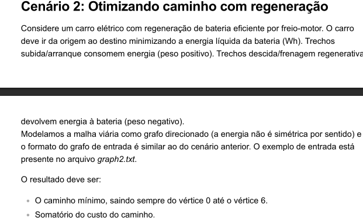
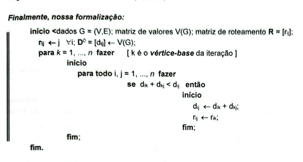

# Desafio 2 



### O  arquivo cenario 2.py 
<div>
  <p>O arquivo cenario 2.py contém a implementação do pseudocódigo do BellmanFord visto em sala. Para o cenário o algoritmo de BellmanFord foi o escolhido pois leva em consideração pesos negativos.</p>
  
  <p>No código podemos ver que o constrtor da classe BellmanFord cria a <strong>matriz de adjacência</strong>, a <strong>matriz de distâncias</strong> e a <strong>matriz de roteamento.</strong> </p>
  
</div>

```python
    def __init__(self) -> None:
        ReadFile.__init__(self)
        self.nosfloyd = self.openfile
        GraphAdjMatrix.__init__(self, n = self.nos[0], directed = True)
        
        # Matriz de Distância
        n = self.nos[0]
        self.dist = [[float('inf') for _ in range(n)] for _ in range(n)]

        # Diagonais igual a 0
        for i in range(n):
            self.dist[i][i] = 0


        # Construído a matriz de Recorrência
        for i in range(2, len(self.nos), 3):
            # Construí os pesos iniciais D0
            v = self.nos[i] 
            w = self.nos[i+1] 
            weight = self.nos[i+2]
            
            self.addEdge(v,w)
            self.dist[v][w] = weight
```

### Formalização do Algoritmo de Bellman-Ford

**Finalmente, nossa formalização:**

**Início** ← dados $G = (V,E)$; matriz de valores $V(G)$; matriz de roteamento $R = [r_{ij}]$;

$$r_{ij} \leftarrow j \quad \forall i; \quad D^0 = [d_{ij}] \leftarrow V(G);$$

**para** $k = 1, ..., n$ **fazer** [ $k$ é o vértice-base da iteração ]

$$
\begin{align}
&\text{início} \\
&\quad \text{para todo } i, j = 1, ..., n \text{ fazer} \\
&\quad \quad \text{se } d_{ik} + d_{kj} < d_{ij} \text{ então} \\
&\quad \quad \quad \text{início} \\
&\quad \quad \quad \quad d_{ij} \leftarrow d_{ik} + d_{kj}; \\
&\quad \quad \quad \quad r_{ij} \leftarrow r_{ik}; \\
&\quad \quad \quad \text{fim;} \\
&\quad \text{fim;} \\
&\text{fim.}
\end{align}
$$

### Correspondência entre Pseudocódigo Bellman-Ford e Implementação Python

**Segue a implementação do pseudocódigo no arquivo cenario 2.py:**

| **Pseudocódigo** | **Código Python** | **Explicação** |
|------------------|-------------------|----------------|
| `dados G = (V,E); matriz de valores V(G)` | `GraphAdjMatrix.__init__(self, n = self.nos[0], directed = True)` | Inicialização do grafo com vértices e arestas |
| `D⁰ = [dᵢⱼ] ← V(G)` | `self.dist = [[float('inf') for _ in range(n)] for _ in range(n)]` | Criação da matriz de distâncias inicial |
| `rᵢⱼ ← j ∀i` | `self.M[v][w] = w (arquivo uteis - class GraphAdjMatrix - método addEdge)` | Inicialização da matriz de roteamento |
| `para k = 1, ..., n fazer` | `for k in range(self.nos[0]):` | Loop externo do vértice intermediário k |
| `para todo i, j = 1, ..., n fazer` | `for i in range(self.nos[0]):`<br>`for j in range(self.nos[0]):` | Loops aninhados para todos os pares (i,j) |
| `se dᵢₖ + dₖⱼ < dᵢⱼ então` | `if matriz_dist[i][k] + matriz_dist[k][j] < matriz_dist[i][j]:` | Condição de relaxamento da distância |
| `dᵢⱼ ← dᵢₖ + dₖⱼ` | `matriz_dist[i][j] = matriz_dist[i][k] + matriz_dist[k][j]` | Atualização da distância mínima |
| `rᵢⱼ ← rᵢₖ` | `self.M[i][j] = self.M[i][k]` | Atualização da matriz de roteamento |

```python
# Implementação completa do algoritmo Bellman-Ford (variação Floyd-Warshall)
for k in range(self.nos[0]):                    # k é o vértice intermediário
    for i in range(self.nos[0]):               # i é o vértice origem
        for j in range(self.nos[0]):           # j é o vértice destino
            # Verifica se o caminho i→k→j é melhor que o caminho direto i→j
            if matriz_dist[i][k] + matriz_dist[k][j] < matriz_dist[i][j]:
                matriz_dist[i][j] = matriz_dist[i][k] + matriz_dist[k][j]  # Atualiza distância
                self.M[i][j] = self.M[i][k]                                 # Atualiza roteamento
```

**Observações importantes:**
- `self.dist` representa a matriz D de distâncias mínimas
- `self.M` representa a matriz R de roteamento para reconstruir caminhos
- Este é o algoritmo de **Bellman-Ford** adaptado com programação dinâmica (similar ao Floyd-Warshall)
- O Bellman-Ford é escolhido pois **suporta pesos negativos**, essencial para o cenário de regeneração de bateria
- O algoritmo encontra caminhos mínimos entre todos os pares de vértices, considerando arestas com peso negativo